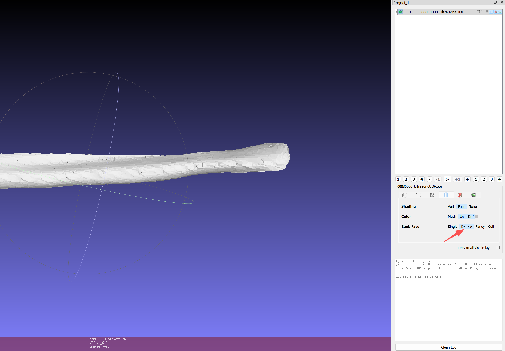

# UltraBoneUDF: Self-Supervised Bone Surface Reconstruction from Ultrasound Using Neural Unsigned Distance Functions

---

This repository contains the official implementation of **UltraBoneUDF**.

**Paper:** https://doi.org/10.1016/j.compmedimag.2025.102690

## 1. Environment

The code has been tested with the following setup:

- **Operating System:** Windows 11 and Ubuntu
- **Python:** 3.10, 3.11
- **CUDA:** 12.6, 12.8
- **PyTorch:** 2.7.1

To run the code, you can either:  
a) install the dependencies, or  
b) run the project using the provided Docker image.

### 1.1 Install dependencies

Install all packages listed in `requirements.txt`:

```
pip install -r requirements.txt
```


## 1.2 Docker 
A Dockerfile is provided in the root directory. Alternatively, you can use the prebuilt Docker image directly:

- luohwu123/ultraboneudf:latest
# 2. Dataset

You can download the **UltraBones100k** dataset here:
https://github.com/luohwu/UltraBones100k

The dataset path is defined in `conf/conf_UltraBones100k.conf` (default: `./data/UltraBones100k/`). If your dataset is stored elsewhere, update this path accordingly.

The dataset includes point clouds reconstructed from freehand ultrasound scans (.xyz files). 
By default, we use the versions constructed using the original tracking data and predicted labels. 
If you would like to use other versions (or your own dataset), modify `models/dataset.py` accordingly.

**Note:** The provided point clouds are not preprocessed. 
Applying additional preprocessing, such as outlier removal, can improve performance. 
For example, statistical filtering can reduce the Hausdorff distance.

# 3. Train and evaluate on UltraBones100k

To reconstruct bone surfaces on UltraBones100k, run:

`python main.py --mode train`

Depending on your GPU, reconstructing a single point cloud typically takes under 5 minutes. 
After each reconstruction, the Chamfer distance is computed and printed. 
Outputs are saved under:
- outs/UltraBones100k

Alternatively, to load and evaluate using the pretrained model:

`python main.py --mode validate`

# 4. Double-face rendering for unsigned distance fields
As noted by the authors of DualMesh-UDF:

```
“When dealing with UDF fields, there is no theoretical guarantee for extracting a manifold mesh.”
```

Therefore, reconstruction results should be rendered in double-face mode (or post-processed accordingly). More details can be found here:
https://github.com/cong-yi/DualMesh-UDF/issues/2#issuecomment-1880294820


In MeshLab, this can be enabled via the option highlighted by the red arrow in the screenshot below:
<div align="center">

</div>


# 5. Reference

```bibtex
@article{WU2025102690,
title = {UltraBoneUDF: Self-supervised bone surface reconstruction from ultrasound based on neural unsigned distance functions},
journal = {Computerized Medical Imaging and Graphics},
pages = {102690},
year = {2025},
issn = {0895-6111},
doi = {https://doi.org/10.1016/j.compmedimag.2025.102690},
url = {https://www.sciencedirect.com/science/article/pii/S0895611125001995},
author = {Luohong Wu and Matthias Seibold and Nicola A. Cavalcanti and Giuseppe Loggia and Lisa Reissner and Bastian Sigrist and Jonas Hein and Lilian Calvet and Arnd Viehöfer and Philipp Fürnstahl},
keywords = {Ultrasound bone surface reconstruction, Neural unsigned distance function, Neural implicit representation},
}
```

# 6. Code reference.

This code is adapted from the following repositories (many thanks to the contributors):
- FUNSR: https://github.com/chenhbo/FUNSR
- DualMesh-UDF: https://github.com/cong-yi/DualMesh-UDF


# License
[](https://creativecommons.org/licenses/by/4.0/)

This work is licensed under the Creative Commons Attribution 4.0 International License. Details in license.txt

### Questions or Feedback?

If you have questions, you can open a new GitHub issue within this repository, and we'll get back to you!
